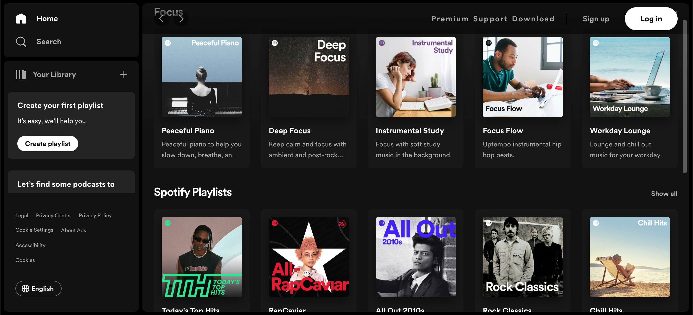
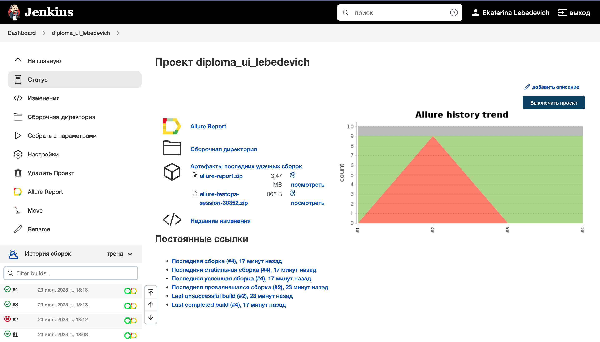
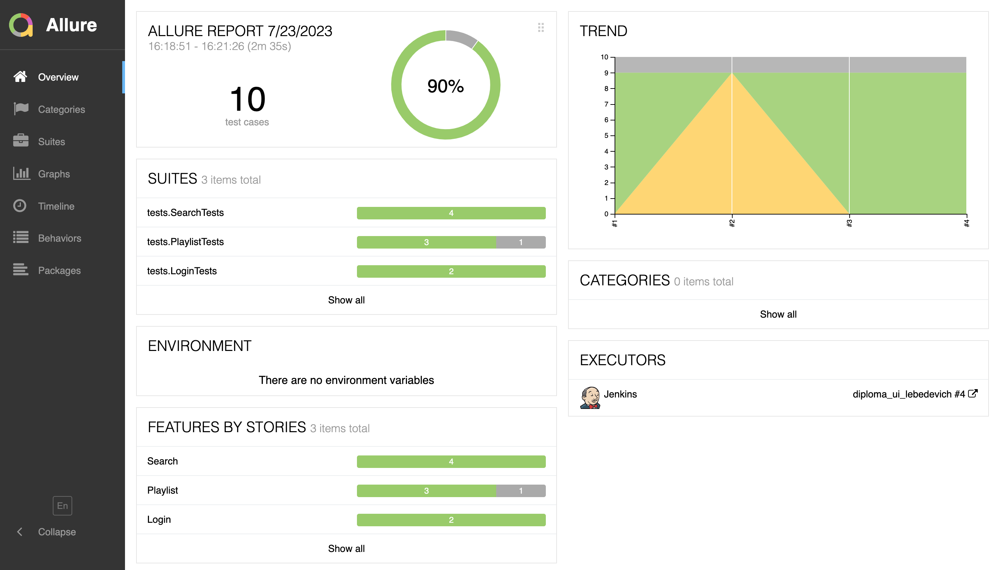
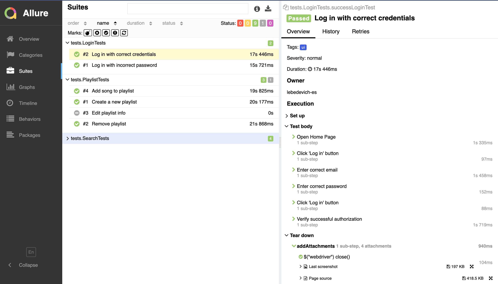
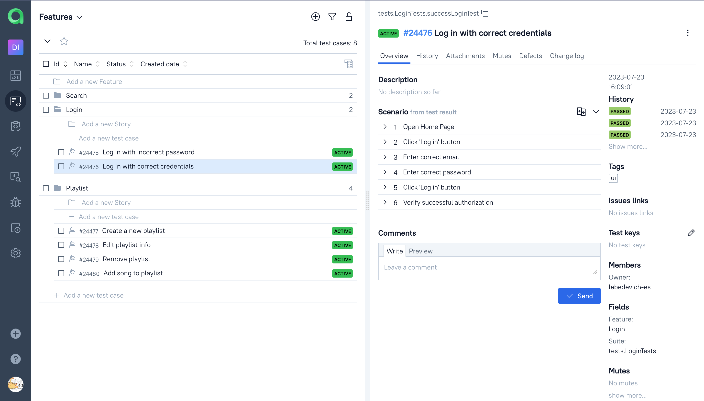
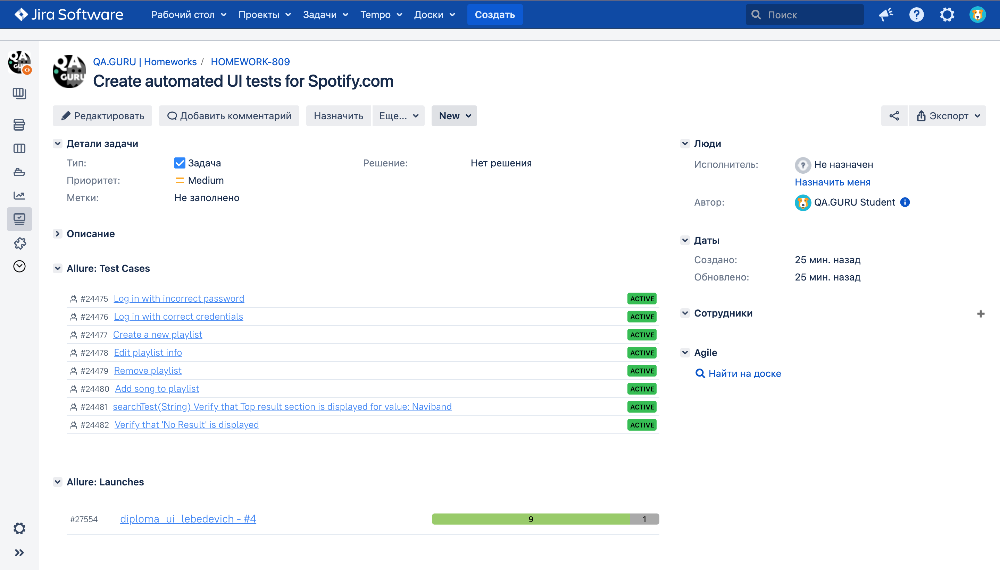
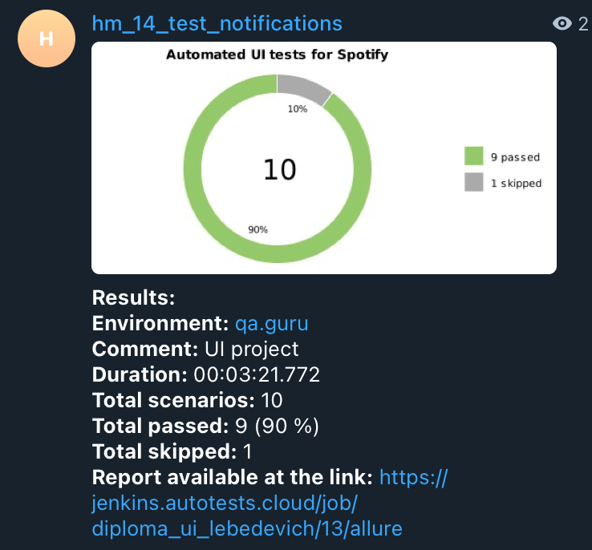
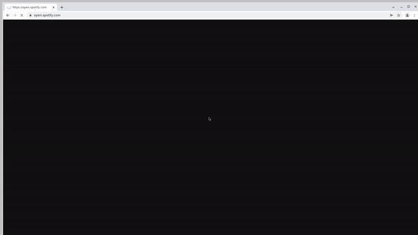

# Automated UI tests for [Spotify](https://spotify.com)



## :pushpin: Content:

- [Stack of technologies](#computer-stack-of-technologies)
- [Running tests](#running_woman-running-tests)
- [Test cases](#page_facing_up-test-cases)
- [Build in Jenkins](#-build-in-jenkins)
- [Allure report](#-allure-report)
- [Allure TestOps Integration](#-allure-testops-integration)
- [Jira Integration](#-jira-integration)
- [Telegram notifications](#-telegram-notifications)
- [Video of an example of running a test in Selenoid](#-video-of-an-example-of-running-a-test-in-selenoid)


## :computer: Stack of technologies

<p align="center">
<a href="https://www.java.com/"></a>
<a href="https://www.jetbrains.com/idea/"></a>
<a href="https://github.com/"></a>
<a href="https://junit.org/junit5/"></a>
<a href="https://gradle.org/"></a>
<a href="https://selenide.org/"></a>
<a href="https://aerokube.com/selenoid/"></a>
<a href="https://docs.qameta.io/allure/"></a>
<a href="https://www.jenkins.io/"></a>
<a href="https://web.telegram.org/"></a>
<a href="https://www.atlassian.com/ru/software/jira"></a>
<a href="https://qameta.io/"></a>
</p>

Autotests are written in <code>Java</code> using <code>JUnit 5</code> and <code>Gradle</code>.
For UI tests, the [Selenide](https://selenide.org/) framework was used.
Tests can be run locally or using [Selenoid](https://aerokube.com/selenoid/).
Also implemented build in <code>Jenkins</code> with generation of Allure-report and sending notification with results to <code>Telegram</code> after completion of the run. All tests are linked with <code>Jira</code> issue's keys.

**Allure report includes:**

* Test execution steps (of automated and manual tests)
* Screenshot of the last step
* Page Source
* Browser console logs
* Video of run


## :running_woman: Running tests

#### To run tests on Selenoid, use the command below:

```
gradle clean test -Denv='remote'
```

#### To run tests locally, use the command below:

```
gradle clean test -Denv='local'
```

### File *config.properties*
To run tests locally, you need to add the <code>config.properties</code> file to the resources folder <code>(src/test/resources/)</code>. The following properties must be specified in this file:
```
email=email
password=password
wrongPassword=wrongPassword
```


## :page_facing_up: Test cases

* Log in with correct credentials
* Log in with incorrect password
* Verify that Top result section is displayed
* Verify that 'No Result' is displayed
* Create a new playlist
* Add song to playlist
* Remove playlist
* Edit playlist info


##  Build in [Jenkins](https://jenkins.autotests.cloud/job/diploma_ui_lebedevich/)
<p align="center">


</p>


##  [Allure](https://jenkins.autotests.cloud/job/diploma_ui_lebedevich/4/allure/) report
### Overview

<p align="center">

</p>

### Test result

<p align="center">

</p>


##  [Allure TestOps](https://allure.autotests.cloud/launch/27554) Integration

Also we can connect <code>Jenkins</code> to the commercial version of <code>Allure</code>, which provides an opportunity to add there manual tests as well as an automated ones:

<p align="center">

</p>


##  [Jira](https://jira.autotests.cloud/browse/HOMEWORK-809) Integration

And also we can see from <code>Jira</code>, which tests been added to <code>Allure</code> with their statuses

<p align="center">

</p>


##  Telegram notifications

<p align="center">

</p>


##  Video of an example of running a test in Selenoid

A video is attached to each test in the report. One of these videos is shown below.
<p align="center">
  
</p>
